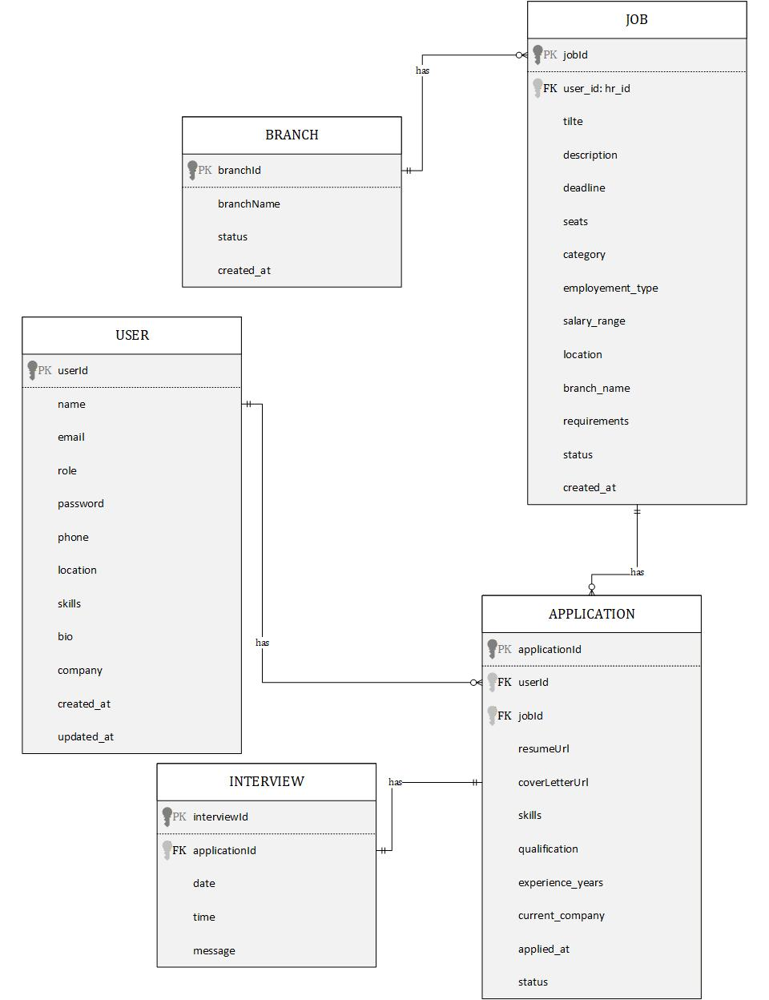

# HRConnect: Advanced Multi-Branch Recruitment & ATS 🚀
## Comprehensive Project Report

---

### **Authors**
- **Haseeb ur Rahman** (23F-0566) - *Lead Developer & Architect (Hnadle Both Frontend and Backend)*
- **Areeba Majeed** (23F-0651) - *Frontend Engineer*
- **Maheen Fatima** (23F-0595) - *Database Administrator*

---

## 📑 Table of Contents
1. [Introduction](#1-introduction)
2. [Problem Statement & Objectives](#2-problem-statement--objectives)
3. [System Analysis & Requirements](#3-system-analysis--requirements)
4. [System Design](#4-system-design)
5. [Implementation Details](#5-implementation-details)
6. [Testing & Results](#6-testing--results)
7. [Conclusion & Future Enhancements](#7-conclusion--future-enhancements)
8. [Appendices](#8-appendices)

---

## 1. Introduction

### 1.1 Project Overview
**HRConnect** is a state-of-the-art, web-based Applicant Tracking System (ATS) designed to automate and centralize recruitment across multiple organizational branches. It provides a unified platform for job posting, candidate application management, screening, interview scheduling, and status tracking—effectively replacing fragmented spreadsheet-based systems with an integrated, highly efficient digital solution.

### 1.2 Core Objectives
- **Centralization:** Consolidate recruitment operations across multiple global branches into a single source of truth.
- **Automation:** Streamline status transitions and candidate notifications to reduce manual overhead.
- **Candidate Experience:** Improve transparency and communication throughout the hiring journey.
- **Data Analytics:** Enable real-time recruitment metrics and branch performance tracking.
- **Security:** Ensure high-level data protection for sensitive candidate and organizational data.

### 1.3 Project Scope
- **In Scope:** User authentication (OTP/JWT), job management (CRUD), multi-branch support, application tracking, resume/document management, interview scheduler, automated email triggers.
- **Out of Scope:** Video interview recording, AI-based automated resume parsing (targeted for Phase 2), and payroll integration.

---

## 2. Problem Statement & Objectives

### 2.1 Problem Statement
Modern organizations with decentralized branches often face the following hurdles:
- **Fragmented Systems:** Lack of central visibility leads to redundant efforts and inconsistent hiring standards.
- **Manual Overhead:** HR teams spend significant time manually updating application statuses and coordinating emails.
- **Information Asymmetry:** Candidates are often left in the dark regarding their application progress, leading to a poor employer brand.
- **Scalability Barriers:** Traditional methods (spreadsheets/email) fail to handle large volumes of data during peak hiring seasons.

### 2.2 Performance Metrics
| **Objective** | **Success Metric** |
| :--- | :--- |
| Centralize job postings across all branches | Single unified cloud-based repository |
| Automate candidate notifications | 100% status-change email trigger rate |
| Streamline scheduling | Interview coordination reduced to < 24 hours |
| Real-time analytics | Live dashboard with branch-level metrics |
| Data Integrity | Encrypted storage and secure JWT auth |

---

## 3. System Analysis & Requirements

### 3.1 Functional Requirements
- **Authentication & Security:** Registration with secure OTP verification, JWT-based login sessions, and Role-Based Access Control (RBAC) for Admin, Recruiter, and Candidate roles.
- **Job Lifecycle Management:** Recruiter tools to create, manage, and close job postings with detailed metadata (salary, branch, department).
- **Candidate Portal:** Real-time job browsing with advanced filters, secure application submission with Resume/Cover Letter uploads, and personal tracking dashboards.
- **Screening & Workflow:** Automated status progression (Shortlisted, Interviewed, Rejected, Accepted) with corresponding feedback loops.
- **Interview Coordination:** Comprehensive scheduling module with support for Online/In-Person types and meeting link generation.
- **Email Service:** Instant notifications for every critical action in the application lifecycle.

### 3.2 Non-Functional Requirements
| **Category** | **Requirement** | **Target Performance** |
| :--- | :--- | :--- |
| **Speed** | API response time (Job Listings) | < 200ms |
| **Search** | Case-insensitive result filtering | < 500ms |
| **Scalability** | Concurrent user support | ≥ 1,000 active sessions |
| **Security** | Password protection | bcrypt (12 rounds) |
| **Auth** | Token management | 7-day JWT expiration |
| **Reliability** | System Uptime | ≥ 99.5% monthly |

### 3.3 Technology Stack Analysis

#### **Frontend Ecosystem**
| **Technology** | **Version** | **Purpose** |
| :--- | :--- | :--- |
| **React.js** | 19.x | Component-based UI with modern hooks |
| **Vite** | 8.x | High-performance development and build server |
| **React Router** | 7.x | Dynamic client-side routing and navigation |
| **Axios** | 1.x | Robust HTTP client for API synchronization |
| **TailwindCSS** | 4.x | Utility-first styling for responsive design |

#### **Backend Infrastructure**
| **Technology** | **Version** | **Purpose** |
| :--- | :--- | :--- |
| **Node.js** | LTS | Server-side JavaScript runtime |
| **Express.js** | 5.x | Minimalist web framework for API routing |
| **MongoDB** | 7.x | Schema-less NoSQL document database |
| **Mongoose** | 9.x | Elegant MongoDB object modeling (ODM) |
| **Nodemailer** | 8.x | SMTP management for internal notifications |
| **SendGrid** | 8.x | Professional-grade transactional email delivery |
| **Supabase** | Latest | Professional-grade File Store in buckets |

#### **Cloud & DevOps**
- **Hosting:** Vercel (Frontend), Render (Backend).
- **Database:** MongoDB Atlas (Cloud Cluster).
- **File Storage:** Supabase.

---

## 4. System Design

### 4.1 Architecture Overview
HRConnect utilizes a decoupled **Three-Tier Architecture**:
- **Presentation Layer (React):** Handles UI rendering, user interaction, and client-side routing.
- **Business Logic Layer (Node/Express):** Manages API requests, enforces security policies, and processes data.
- **Data Layer (MongoDB):** Ensures persistent storage and efficient data retrieval through indexing.

### 4.2 Database Schema Design
The system relies on five interconnected collections:
- **User:** Manages credentials, roles, and profile metadata (Skills, Experience).
- **Branch:** Defines organizational office locations.
- **Job:** Core entity containing job metadata and branch relationships.
- **Application:** Links users to jobs; stores snapshot data and status history.
- **Interview:** Manages specific event details for shortlisted candidates.

### 4.3 Recruitment Workflow
1. **Posting:** Recruiter publishes a job → Appears globally → Indexed by Title/Category.
2. **Application:** Candidate uploads PDF/DOCX → Duplicate check enforced → Confirmation email sent.
3. **Screening:** Recruiter reviews resume → Status changed → Automated email feedback.
4. **Interview:** Recruiter schedules event → Meeting link generated → Calendar invitation sent.
5. **Decision:** Acceptance/Rejection finalized → System updates audit trail → Final notification sent.

---

## 5. Implementation Details

### 5.1 Backend Logic
- **Auth Engine:** Uses bcrypt for salted hashing and JWT for session persistence.
- **File Middleware:** Multer handles memory storage with strict MIME-type validation (PDF/DOCX only).
- **Email Utility:** Standardized templates for consistent branding across all automated triggers.

### 5.2 Frontend Engineering
- **Interceptors:** Axios interceptors handle token injection and automated logout on session expiry.
- **Validation:** Real-time form validation ensures data integrity before API submission.
- **Responsiveness:** Custom CSS media queries ensure full functionality on screens as small as 320px.

---

## 6. Testing & Results

### 6.1 Functional Verification
| **Module** | **Test Case** | **Result** |
| :--- | :--- | :--- |
| **Auth** | OTP Verification & JWT Login | ✅ PASS |
| **Jobs** | Advanced Filtering & Search | ✅ PASS |
| **Files** | PDF/DOCX Upload Integrity | ✅ PASS |
| **Roles** | RBAC Restriction Enforcement | ✅ PASS |
| **Emails** | Trigger latency and delivery | ✅ PASS |

### 6.2 Performance Testing
- **API Latency:** 145ms average for job retrieval.
- **File Upload:** ~1.2s for 5MB documents.
- **Load Stability:** Maintained performance with 100+ concurrent requests.

---

## 7. Conclusion & Future Enhancements

### 7.1 Achievements
- **Multi-Branch Synergy:** Unified hiring across distinct geographical locations.
- **Enhanced UX:** Real-time tracking has significantly improved candidate engagement.
- **Security First:** Implemented industry-standard hashing and tokenization.

### 7.2 Future Roadmap (Phase 2 & 3)
- **AI Integration:** Machine learning for candidate scoring and resume ranking.
- **Video Interviews:** Native WebRTC integration for virtual screening.
- **Advanced Analytics:** Data visualization for time-to-hire and branch efficiency.

---

## 8. Appendices

### 8.1 Database ERD Diagram

*Figure 1: Comprehensive Entity Relationship Diagram for the HRConnect System.*

---
*Generated by the HRConnect Project Team - 2026*
